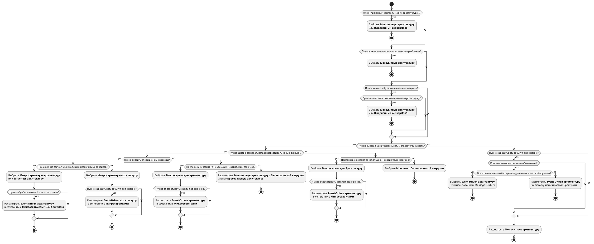

```plantuml
@startuml
' Определяем начальное состояние
start

if (Нужен ли полный контроль над инфраструктурой?) then (yes)
  :Выбрать **Монолитную архитектуру**
  или **Выделенный сервер/IaaS**;
  stop
endif

if (Приложение монолитное и сложное для разбиения?) then (yes)
  :Выбрать **Монолитную архитектуру**;
  stop
endif

if (Приложение требует минимальных задержек?) then (yes)
    if (Приложение имеет постоянную высокую нагрузку?) then (yes)
        :Выбрать **Монолитную архитектуру**
        или **Выделенный сервер/IaaS**;
        stop
    endif
endif

if (Нужна высокая масштабируемость и отказоустойчивость?) then (yes)
  if (Нужно быстро разрабатывать и развертывать новые функции?) then (yes)
    if (Нужно снизить операционные расходы?) then (yes)
        if (Приложение состоит из небольших, независимых сервисов?) then (yes)
            :Выбрать **Микросервисную архитектуру**
            или **Serverless архитектуру**;
              if (Нужно обрабатывать события асинхронно?) then (yes)
                :Рассмотреть **Event-Driven архитектуру**
                в сочетании с **Микросервисами** или **Serverless**;
              endif
              stop
      else (no)
            :Выбрать **Микросервисную архитектуру**;
             if (Нужно обрабатывать события асинхронно?) then (yes)
               :Рассмотреть **Event-Driven архитектуру**
                в сочетании с **Микросервисами**;
             endif
            stop
      endif
    else (no)
       if (Приложение состоит из небольших, независимых сервисов?) then (yes)
            :Выбрать **Микросервисную архитектуру**;
            if (Нужно обрабатывать события асинхронно?) then (yes)
                 :Рассмотреть **Event-Driven архитектуру**
                  в сочетании с **Микросервисами**;
              endif
            stop
        else (no)
            :Рассмотреть **Монолитную архитектуру** с **балансировкой нагрузки**
            или **Микросервисную архитектуру**;
            stop
        endif
    endif
  else (no)
        if (Приложение состоит из небольших, независимых сервисов?) then(yes)
            :Выбрать **Микросервисную Архитектуру**;
           if (Нужно обрабатывать события асинхронно?) then (yes)
              :Рассмотреть **Event-Driven архитектуру**
                в сочетании с **Микросервисами**;
           endif
           stop
        else (no)
             :Выбрать **Монолит с балансировкой нагрузки**;
             stop
        endif
  endif
else (no)
    if (Нужно обрабатывать события асинхронно?) then (yes)
      if (Компоненты приложения слабо связаны?) then (yes)
        if (Приложение должно быть распределенным и масштабируемым?) then (yes)
           :Выбрать **Event-Driven архитектуру**
            (с использованием Message Broker);
           stop
        else (no)
          :Рассмотреть **Event-Driven архитектуру**
          (in-memory или с простым брокером);
          stop
        endif
      endif
    endif
  :Рассмотреть **Монолитную архитектуру**;
  stop
endif

@enduml
```