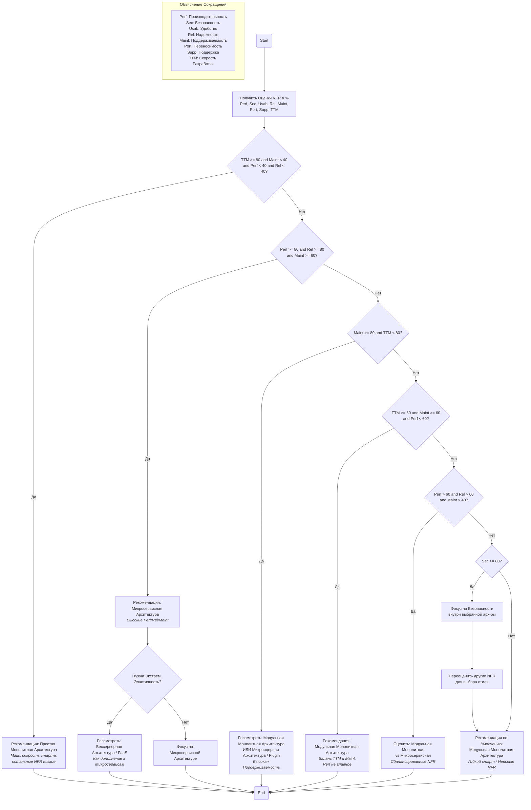

# Introduction

# Chapter 1. Theoretical Background (skip theory)

# Chapter 2. Problem Domain Analysis and Problem Statement

## 2.1. Analysis of Existing Systems
References

## 2.2. Business Requirements
### 2.2.1. Goal

## 2.3. Functional Requirements
### 2.3.1. Use Case (not implemented)

## 2.4. Non-Functional Requirements
| Name            | 0% | 20% | 40% | 60% | 80% | 100% |
| :-------------- | :-: | :-: | :-: | :-: | :-: | :-: |
| **Performance** (Производительность)| x | - | - | - | - | - |
| **Security** (Безопасность) | x | - | - | - | - | - |
| **Usability** (Удобство использования)| x | - | - | - | - | - |
| **Reliability** (Надежность) | x | - | - | - | - | - |
| **Maintainability** (Поддерживаемость) | x | - | - | - | - | - |
| **Portability** (Переносимость) | x | - | - | - | - | - |
| **Supportability** (Возможность поддержки) | x | - | - | - | - | - |
| **Time to Market** (Скорость разработки) | - | - | - | - | - | x |

| Service       | No | Yes  |
| :------------ | :--: | :--: |
| Logic         | - | x |
| Test          | x | - |
| Coverage      | x | - |
| Profiler      | x | - |
| Logger        | x | - |
| Builder       | x | - |
| Database      | x | - |
| Configuration | x | - |
| Documentation | x | - |

# Chapter 3. Design and Implementation

## 3.1. Technology Stack Selection
* Julia
* Docker
* GitHub
* SQLite3
## 3.1. IT-infostructure

## 3.2. Component Diagram (not implemented)

## 3.3. ERD Diagram (not implemented)

## 3.4. Class Diagram

```plantuml
@startuml
namespace task {
}
@enduml
```

## 3.5. File Structure (not implemented)
Тут можно добавить статистику 
* Сколько строчек кода
* Сложность функций
* Графики
* Сколько памяти занимает каждый файл
* Пояснение каждого файла

# Chapter 4. Testing and Results

## 4.1. Testing Methods (дерево решений)

## 4.2. Test Results 
* Таблица со всеми тестами
  * По памяти
  * По скорости (среднее время)
  * Логика
  * Какая часть кода была покрыта этим тестом
  * Input/Output

## 4.3. Results Analysis
* Графики
* Текстовый вывод

# Conclusion

# References

# Appendix A. Backend Code Listing

# Appendix B. Frontend Code Listing
